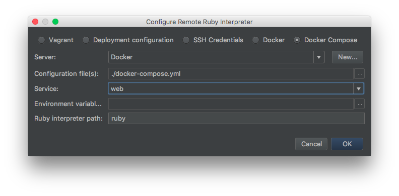
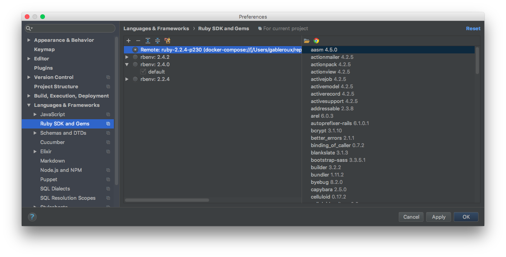
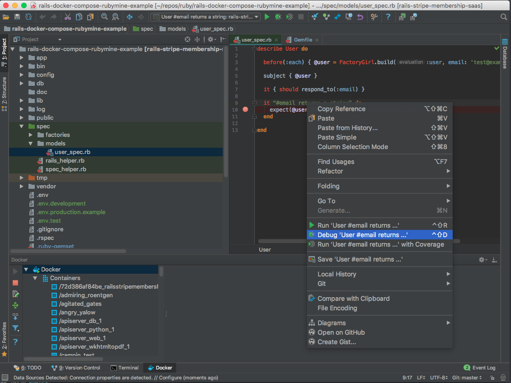
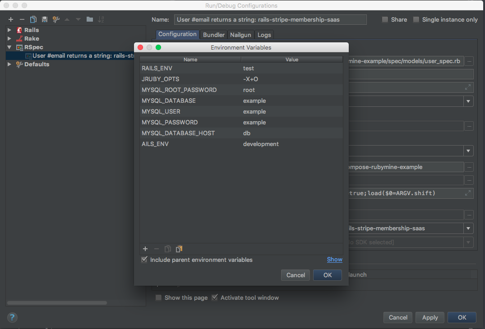
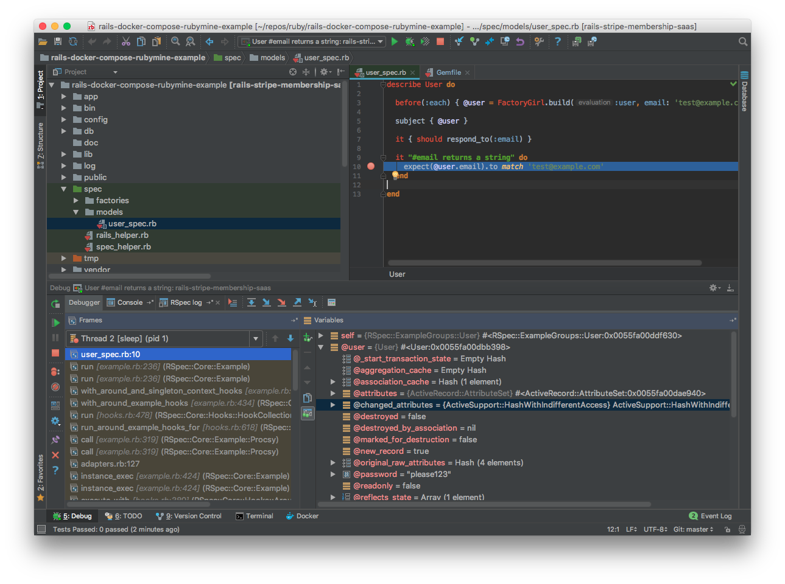

# Ruby on Rails 4.2 docker-compose example project

I wanted to run tests and have breakpoints in RubyMine in a Ruby on Rails 4.2 application running inside docker-compose. Current code base is based on the sample project [Rails Stripe Membership Saas](https://github.com/railsapps/rails-stripe-membership-saas). I added docker-compose support and RubyMine setup instructions :tada:.

## Getting started

```bash
cp .env.test .env
docker-compose up -d
docker-compose exec web bundle exec rake db:migrate
```

## RubyMine

I created this project to demonstrate how to run tests inside Docker using [RubyMine IDE](https://www.jetbrains.com/ruby/) or [IntellijIdea](https://www.jetbrains.com/idea/).

### Important files

* [Dockerfile](Dockerfile)
* [docker-compose.yml](docker-compose.yml)
* [.env.test](.env.test)
* [config/database](database.yml)
* [Gemfile](Gemfile)

What to add to your `Gemfile`:

```ruby
group :development, :test do
  gem 'ruby-debug-ide'
  gem 'debase'
end
```

*I personally had to also maintain local versions of gems for the `ruby-debug-ide` gem to get loaded into the IDE*. This repository has a [`.ruby-version`](.ruby-version) which is used by *[rbenv](https://github.com/rbenv/rbenv)*.

[rbenv](https://github.com/rbenv/rbenv) installation commands on MacOS:

```bash
brew install rbenv ruby-build ruby
rbenv init
```

For the current repository:

```bash
rbenv install
rbenv version
rbenv local
gem install bundler
bundle install
```

## RubyMine step by step

Edit: I had a wrong configuration and a local mysql installation which let me think it was working at first.
** 🔴 This is not working and ruby is being ran locally on my system. See [#1](https://github.com/GabLeRoux/rails-docker-compose-rubymine-example/issues/1)**

Tested on RubyMine 2017.3.2 EAP :+1:.

1. Open settings -> Ruby SDK and Gems -> Add (+)
2. Select docker-compose, setup Docker server and select `web` service (from docker-compose file)



3. Right click on a test to add as a run configuration

4. Tweak the run configuration by adding environment variables. Hint on macos:
   ```bash
   cat .env | pbcopy
   ```
   Then hit the clipboard icon to paste all env variables at the same time

5. Execute the run configuration in debug mode :v:


## License

[MIT](LICENSE.md) © [Gabriel Le Breton](https://gableroux.com)
